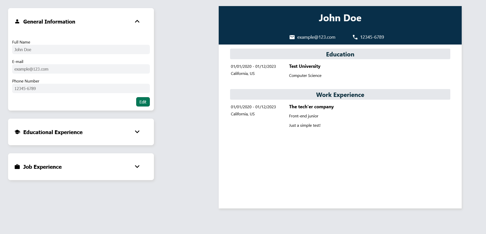

# CV Application

This project marks the beginning of my React journey. It is a website that simulates creating a simple curriculum, with editable sections on work and education experiences. It utilizes heavily the concepts of state and props, and served as a very good learning exercise for me to work with.

To start this project, I first did the basic layout and color palette with CSS. During this phase, I wanted to make a simple design, but that was still nice and pleasing to look at, which I would say worked out fine.

After this, I started work on the functionalities of the site. It was a bit overwhelming at first, due to me having never worked with React before, but I quickly familiarised myself with it, and it was definitively satisfying to see the final result. The most difficult part of this project was probably making the information editable, as it required me to pretty much redo a lot of work I had previously done, but it made for more efficient code I believe, so I'll take it.